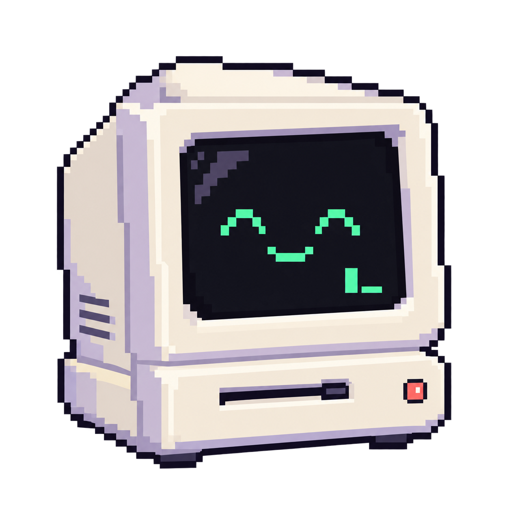
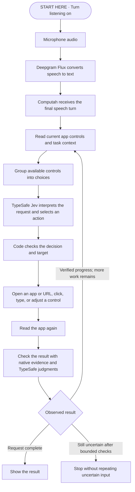

<p align="center"></p>

# Computah

An experimental project to learn about TypeSafe's Jev.

Control your Mac with your voice.

Computah reads the controls that apps provide through macOS Accessibility.
These controls form an **Accessibility tree**: a hierarchy of windows, buttons,
text fields, and other interface elements.

Deepgram converts speech to text. TypeSafe's Jev model interprets the command
and chooses the next action. Computah sends the action and checks the result.
Voice input currently uses Deepgram's English model.

**This is an experiment.** Some apps provide incomplete controls. The model can
choose the wrong action. Check the results before you trust Computah with important work.

## How it works

The main command flow is shown below. TypeSafe participates in action selection
and result checks throughout the flow.



### 1. Receive speech

When listening is on, Computah converts microphone audio to 16 kHz mono PCM16.
It streams this audio to Deepgram Flux through a WebSocket connection.
Deepgram returns transcript updates and events that identify each speech turn.
A speech turn is one utterance that Deepgram tracks from its start to its end.

Computah checks the session and turn IDs before it accepts an update.
The notch shows the transcript as you speak.
Debug Mode also accepts typed commands through the same command controller, without Deepgram.

### 2. Prepare before speech ends

Deepgram can report that a turn is likely to end before it confirms the final transcript.
Computah uses this early signal to read controls and ask TypeSafe for a possible action.
It sends no app input during this preparation.

| Deepgram event | Computah response |
| --- | --- |
| `StartOfTurn` | Suspend the previous command's permission to send more input. |
| `EagerEndOfTurn` | Prepare a possible action without executing it. |
| `TurnResumed` | Discard the early preparation because speech continued. |
| `EndOfTurn` | Submit the final command. Reuse preparation only when its text matches the final transcript. |

### 3. Let TypeSafe choose the next action

Computah reads the current app's controls and finds installed apps.
It groups possible actions and retains references to the original controls.
Jev receives the command, selected app evidence, and relevant task context.

Jev decides what the user means, which part of the request comes next, and which action can advance it.
It can select an app, a web address, or an action on a control.
It can also report that no available choice matches.

Large choice lists are split into groups. The selector compares retained choices
in a later request. Independent questions can share a request when they use the same data.
Text, numbers, and addresses can require additional value checks.

Code checks the returned action IDs, source text positions, values, and limits.
App names and command words do not select special code paths.
Prompt instructions are stored separately from the execution code.

### 4. Send checked input

Before input, Computah checks that the command still has permission to act.
It also checks the app, window, and selected control against the observation used for selection.

The native layer can open apps or URLs, click controls, type text, and adjust values.
It uses physical clicks or an available `AXPress` action under defined target checks.
It does not send both methods for the same action.

Computah focuses the intended editor before it sends keyboard input.
It checks the bound control again after focus changes.
Text replacement also requires the expected selection and exact text readback.
Uncertain input is never repeated to discover whether it worked.

### 5. Check the result

Sending an action does not prove success. Computah reads the app again.
Native checks confirm observable facts. TypeSafe judgments check control goals
against the requested result and intended object.
Some operations, such as app activation, use native result checks.

After verified progress, Computah continues if more work remains.
Missing controls can trigger a limited recovery read of a larger area or a specific region.
If bounded checks cannot confirm an effect, Computah stops without repeating the uncertain input.
The notch and debug panel show the result.

### When you speak again

A new speech turn suspends the old command's permission to send more input.
Jev decides whether the new request replaces, changes, continues, adds to, or cancels the previous task.

Computah retains completed steps and pending effects in a task checkpoint.
A checkpoint records progress so the controller can continue work after an interruption.
Before it continues earlier work, it checks any uncertain action that was already sent.
Cancellation cannot undo an action that an app already received.

## Set up

You need:

- A Mac with macOS 14 or later.
- Xcode or Command Line Tools with Swift 6.
- Python 3 for the build scripts.
- A [TypeSafe API key](https://docs.typesafe.ai/introduction/quickstart) for commands.
- A [Deepgram API key](https://developers.deepgram.com/docs/create-additional-api-keys) for voice input.

The Swift package has no third-party packages. Provider use may have a cost.

Open a terminal in this folder. Create your local settings file:

```sh
cp .env.example .env
chmod 600 .env
```

Open `.env` in your editor. Fill in `TYPESAFE_API_KEY` and `DEEPGRAM_API_KEY`.
Do not share this file. The Deepgram key is optional if you only use typed commands in Debug Mode.

Build and open the app:

```sh
zsh scripts/run.sh
```

In **System Settings → Privacy & Security → Accessibility**, add and enable `outputs/Computah.app`.
Allow microphone access when you first start listening.
The app appears at the top of your screen.

## Use it

- Press **Control + Option** together to start or stop listening.
- Move the pointer over the notch to see the transcript and listening controls.
- Open the **…** menu to select **Open Debug Mode…**.
- In Debug Mode, type a command and select **Run**, or press **Return**.
- Run hides the debug panel while the command executes.
- Reopen Debug Mode and select a command to see its result, steps, and technical details.
- Turn on **Track Jev costs** in Debug Mode to save an estimated running total across launches.
  It starts off. Use **Reset…** to clear the local total. Missing usage is marked incomplete.
- Use **Quit Computah** in the notch menu to exit.

Computah sends microphone audio to Deepgram while it listens.
It sends commands and selected app content to TypeSafe.
This content can include document text and private information. See [privacy](docs/PRIVACY.md).

The microphone can pick up computer speakers and nearby voices.
Computah does not identify the speaker.

The debug panel keeps the latest 30 results in memory.
It does not save command history unless you enable [diagnostic saving](docs/PRIVACY.md#save-debug-history).

## Build and change it

```sh
zsh scripts/build.sh     # Build outputs/Computah.app.
zsh scripts/run.sh       # Build and open the app. Quit any running copy first.
```

The package has two production targets. A target is a module that Swift builds separately.
`Computah` depends on `ComputahCore`. The core does not depend on the interface or speech code.
Folders within the core organize responsibilities; they are not separate modules.

| Folder | Responsibility |
| --- | --- |
| `Sources/Computah` | The notch, debug panel, microphone, and app startup. |
| `Sources/ComputahCore/Accessibility` | Read and group app controls. Send checked native input. |
| `Sources/ComputahCore/Commands` | Track work, handle new requests, and check results. |
| `Sources/ComputahCore/Language` | Send typed questions to Jev and check its replies. |
| `Sources/ComputahCore/Prompts` | Store instructions that explain the questions to Jev. |
| `Tests` | Run five end-to-end tests with real speech providers and apps. |

Start with [architecture](docs/ARCHITECTURE.md).
See [testing](docs/TESTING.md) for the five live end-to-end tests and current limits.
These tests require explicit opt-in and an idle Mac. The build does not run them.
See [setup help](docs/SETUP.md) if the app does not respond.

## License

[MIT](LICENSE). The bundled sounds include their [Cuelume license](Sources/Computah/Resources/Sounds/Cuelume-LICENSE.txt).
