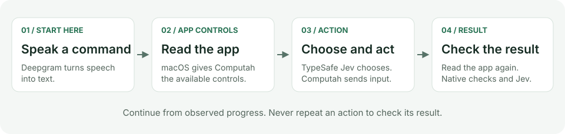

# Architecture

Computah is one Swift package with two production targets.
A target is a module that Swift builds separately.
`Computah` owns the app interface and speech input.
`ComputahCore` reads app controls, asks Jev questions, and runs commands.
The core does not import the interface or speech code.
The notch shows transcripts and listening controls. It does not accept keyboard input.
Typed commands are available in Debug Mode.
Folders within the core organize responsibilities. They are not separate modules.

See the [README](../README.md#how-it-works) for the full flow from Deepgram to action verification.

## Where to start

| File or folder | Purpose |
| --- | --- |
| `Computah/App.swift` | Connect speech, Debug Mode command input, execution, and the interface. |
| `Computah/Voice.swift` | Stream microphone audio to Deepgram and receive text. |
| `Computah/UI` | Show the notch, listening sounds, shortcut, and debug panel. |
| `Computah/LaunchOptions.swift` | Parse startup options once and reject invalid diagnostic modes. |
| `Computah/Diagnostics` | Run explicit tests and manage optional saved history. |
| `ComputahCore/AppRouting.swift` | Find installed apps and the default browser. |
| `ComputahCore/Accessibility` | Read and group controls. Send checked native input. |
| `ComputahCore/Commands/CommandCoordinator.swift` | Own the active request and handle interruptions. |
| `ComputahCore/Commands/CommandEngine.swift` | Prepare an action from the request and observed controls. |
| `ComputahCore/Commands/Workflow.swift` | Run steps and check each result. |
| `ComputahCore/Commands/WorkflowCheckpoint.swift` | Retain the original request, completed steps, and pending effects. |
| `ComputahCore/Language` | Ask Jev typed questions and validate its answers. |
| `ComputahCore/Prompts/language.json` | Store the model's instructions. |

Paths in this table start under `Sources/`.

## From input to action

1. Speech messages carry turn IDs. These IDs identify new input without inspecting command words.
2. A new turn revokes the old task's permission to send more input.
3. The engine reads the current app's Accessibility data and lists possible actions.
4. Jev interprets the request in context. It decides whether the request replaces, changes, continues, adds to, or cancels earlier work.
5. Jev selects part of the request and an action. Code checks the source text positions and returned IDs.
6. The workflow sends the action only if the app, window, control, and input permission still match.
7. The workflow reads the app again. It confirms completion only from relevant observed evidence.

### Activate controls

Computah normally uses a physical click after it checks the control under the pointer.
This check is called hit testing.
If hit testing cannot identify the selected control, Computah can use an available `AXPress` action.
This alternative requires the same validated native control and no previous input for that action.
An explicit diagnostic mode can compare `AXPress` directly.

A run never sends both methods for the same action.
It never repeats input after an unconfirmed effect.
After verified progress, the model may select the same control for a new intentional step.

An action can open a new window. Verification may observe that window without authorizing further input.
The before-state includes native window identities, which help distinguish a new window from an existing one.
Jev must establish the requested effect and target relationship before execution continues.
The same rules apply when an interrupted command resumes.
Verification also receives the completed instructions from the checkpoint.
This preserves references between instructions without treating earlier work as proof of a new effect.

App startup and window transitions allow a limited wait for accessible controls.
Ready surfaces incur no extra delay.
Verification retains counts for observed collections, including grids.
Progress history includes collection counts from before and after the action.

Counts alone do not establish creation.
Verification checks the whole requested result and intended object, including after a numeric setting matches.

### Cache Accessibility setup

Successful Accessibility setup is cached by process ID (PID) and launch date.
A cache lets later reads reuse a successful setup result.
Failed setup and unknown launch dates are not cached.
Recovery invalidates the entry so the next read attempts setup again.

### Insert text

Text input requires focus on the intended editor.
The actor requests focus, then uses a checked click if focus is still absent.
It checks the native target again before typing.
Replacement requires selection of the original value and exact readback of the replacement.
All text input still requires verification of the requested outcome.

### Prepare model choices

[What Computah sends to Jev](JEV_REQUESTS.md) documents the payload fields and shows example request and response JSON.

Independent model questions have named keys.
Questions can share a request when they use the same data.
Large option lists are split into groups.
The selector compares retained candidates in a later request.
It also offers an answer for cases where no choice matches.
If a selected target has no applicable operation, one further selection considers the remaining concrete operations.
Planning can choose a control that reveals more choices. It does not claim completion.
Verification checks the final object separately from the target of an intermediate step.
These questions share one provider request.

URL navigation first checks the loaded document for an exact destination match.
If the URL differs, Jev checks the observed document identity against the requested destination.
This supports redirects without app-specific host aliases.
Unchanged document evidence does not trigger another model request.
If controls are missing, recovery can read a wider area or a specific region.

## Checks that must stay

- Keep the user's original text and its source positions. Do not invent replacement commands.
- Keep native control references with the observation that created them. Do not send these references to the model.
- Check the target again before input. An old screen position is not a stable control identity.
- Keep key-down and key-up together. A canceled task must still release a pressed key.
- Do not repeat an action to find out whether it worked.
- Treat an unknown result as unknown. A sent click is not proof of success.
- Check the intended document or item when work continues after an interruption.
- Treat text from apps as data, not instructions.

## What belongs in code

Code handles API formats, macOS control types, source positions, numeric ranges,
time limits, and permission to send input. These checks work across apps.

Jev handles meaning: the user's intent, the next target, and the relationship between requests.
Do not add app-name switches, command-word lists, or regular expressions that decide intent.
Keep model instructions separate from these checks.

Repeated prompt passages are stored once under `shared` in `language.json`.
The loader expands references before it sends a question.
Question names connect answers to code. Instructions explain the meaning of each question.
Evaluate changed instructions against captured real-app evidence before you adopt them.

The core uses public macOS Accessibility and input APIs.
It has no browser extension, private app selector, model that reads screenshots, or external automation package.

The app catalog is refreshed during preparation.
It combines conventional install folders, running apps, and the system metadata index.
Discovery in custom locations depends on index coverage.
The catalog excludes embedded helper apps.

Speech buffering has a fixed capacity.
If audio is dropped or cannot be converted, Computah invalidates the feed and suspends command input.
The user must start a complete utterance again.

Live capture uses the system microphone input without engine voice processing.
Speaker playback and nearby voices can enter the transcript.
Capture does not identify the speaker.
Supplied diagnostic PCM bypasses microphone capture.

## Debug data

The app holds recent results in memory. Saved history is optional.
When first opened, the debug panel loads the newest 30 saved report bodies outside the interface thread.
It then merges those reports with current results.
Files are selected by modification time before decoding.

Optional Jev cost accounting runs at the HTTP request boundary, independently of workflow reports.
A request captures whether tracking is enabled before it is sent.
Its reply adds provider-reported usage once, even if the command was later replaced.
Reset changes the accounting generation so earlier replies cannot refill the cleared total.
The app saves aggregate totals on a serial background queue. Request processing does not wait for disk writes.
Unknown usage and unknown model prices remain visible as an incomplete estimate.

Routine input auditing is off.
Explicit scenario and audio diagnostics keep a limited event history.
Each input permit retains its effect count, even after revocation.
An input permit records which command has authority to send input.

Speech metadata lets Computah reject old provider turns.
The controller retains 128 recent final turn IDs to reject duplicate submissions.
See [privacy](PRIVACY.md) for storage paths and deletion.
